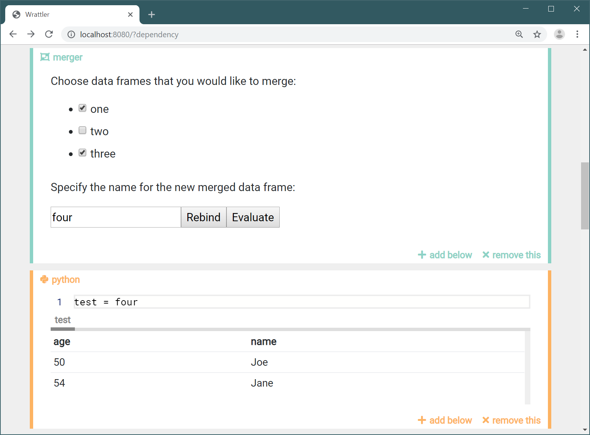
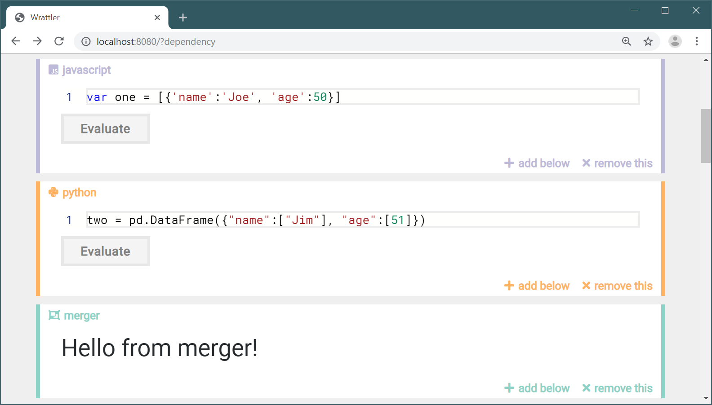
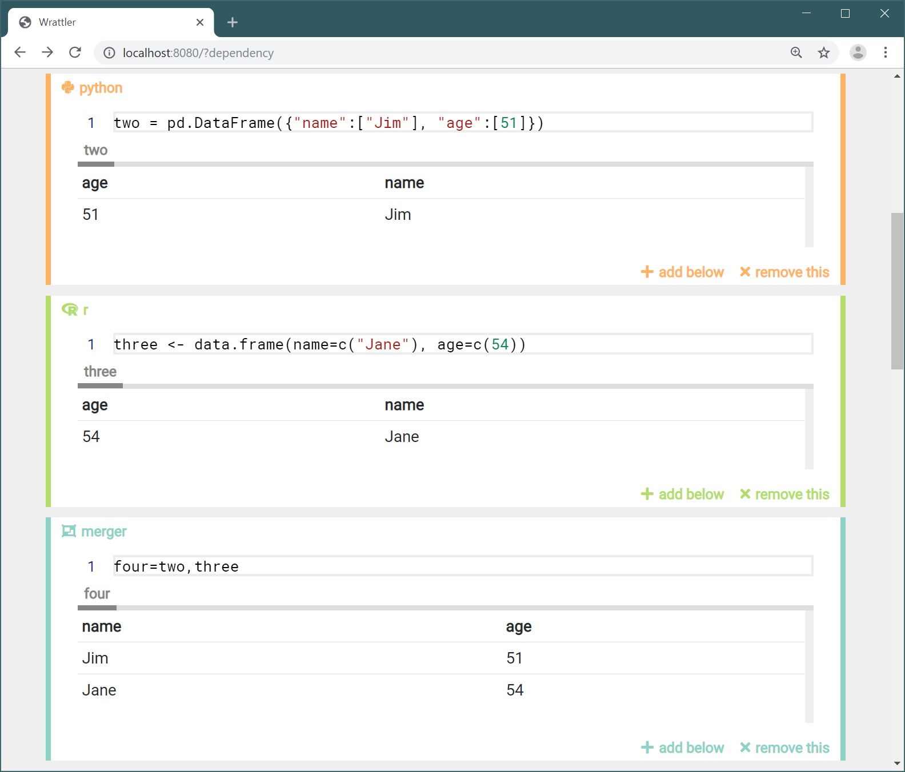

# Creating custom language plugins

Wrattler is a polyglot notebook system that can be easily extended to support
new programming languages and data exploration and analysis tools. Wrattler
is browser-first, meaning that it does as much work as possible in the web
browser. If you use Python or R, Wrattler needs to call an external service
to run your code, but if you use JavaScript (and other browser-only components),
then Wrattler can run fully in the web browser.

In this tutorial, we look at building browser-based plugin for Wrattler. We
will implement a simple Wrattler extension that defines a new kind of notebook
code block with custom (HTML) user interface. The extension does not do anything
useful. It lets you concatenate one or more data frames defined earlier and
export the result as a new data frame. However, it illustrates many of the
aspects of Wrattler.

The following shows our new Wrattler code block, letting the user choose from
existing frames `one`, `two` and `three`, and specifying new name for the
resulting data frame.



The technique described in this tutorial is suitable if:

- You have a programming language that runs fully in the browser, or
  if you want more control over how an external service is called to
  evaluate code.
- If you want to create your own user interface, rather than just use
  a standard code editor with tabs showing previews of evaluated
  data frames and figures.  
- If you are writing custom tool that is not a programming language
  in the usual sense, but is something more interactive that requires
  more control over how the code block works and looks.

If, instead, you want to add a support for a programming language that runs
on the server, like Python or R, and you want to reuse standard look of Wrattler
code blocks, then you probably want to [create an external language runtime
services](external.html)

## Step 1: Creating Hello World plugin

In the first step, we'll create a plugin that adds a new kind of code blocks. When
you add a code block using this plugin (or language), it will just display
`"Hello from merger!"`, but it will not do any data processing. I call the
tool "Merger" because it lets you merge data frames.

### Building Wrattler and adding a new file

For simplicity, we assume that the work is done by directly editing the
main [Wrattler repository](http://github.com/wrattler/wrattler). For
instructions on how to build and modify that, see the [development notes
guide](development.html). Now, the next step is to add a new TypeScript
source file. The source code for the Wrattler web components is located
in the `client` folder. There, you can find existing language plugins in
`src/languages`. In this tutorial, we put the implementation of our plugin
in `src/demo/merger.ts`.

To start, we will need to import [Maquette](https://maquettejs.org/), which
is a virtual DOM library that Wrattler uses for user interface, `Md5` function
for hashing and three other components of Wrattler:

```typescript
import * as Langs from '../definitions/languages';
import * as Graph from '../definitions/graph';
import * as Values from '../definitions/values';
import { h } from 'maquette';
import { Md5 } from 'ts-md5';
```

The three Wrattler components we are importing are described in the API documentation:

 - [Languages module](../api/modules/languages.html) defines API for creating language plugins
 - [Graph module](../api/modules/graph.html) provides types for working with the dependency graph
 - [Values module](../api/modules/values.html) contains types used when evaluating notebook blocks

### Creating simple code block editor

Wrattler uses the [Elm architecture](https://guide.elm-lang.org/architecture/)
for implementing its user interface. If you are creating a plugin that defines
a custom user interface, then you'll also need to use this approach in your
language plugin. Wrattler provides a couple of functions to make this easier,
so you do not have to implement the whole user interface from scratch. We
will look at those in Step 4.

In the Elm architecture, you need to define type representing _state_ and a
type representing _events_ that can happen in the application. You then
define two functions:

- `render` takes the current state and renders the user interface using
  a virtual DOM library.
- `update` takes the current state, event that occurred and calculates the
  new state.

When implementing language plugin, your state type needs to implement the
[`EditorState`](../api/interfaces/languages.editorstate.html) interface
and store unique `id` of the code block together with a `Block` object, so a
state with no extra features and empty event type look as follows:

```typescript
type MergerEvent = { }

type MergerState = {
  id: number
  block: Langs.Block
}
```

An editor then needs to implement the [`Editor`](../api/interfaces/languages.editor.html)
interface. In the following, the `update` function returns the original state; the
`render` function returns constant HTML and we also need to add an `initalize` function
that takes the required parameters and stores them in our `MergerState`:


```typescript
const mergerEditor : Langs.Editor<MergerState, MergerEvent> = {
  initialize: (id:number, block:Langs.Block) =>
    { id: id, block: block },
  update: (state:MergerState, event:MergerEvent) =>
    state,
  render: (block:Langs.BlockState, state:MergerState,
           context:Langs.EditorContext<MergerEvent>) =>
    h('div', {}, [ h('h3', {}, [ "Hello from merger!"] ) ])
}
```

Wrattler calls the `render` function with a few extra parameters. In additioon
to the `MergerState` value, we also get state of the code block of type
[`BlockState`](../api/interfaces/languages.blockstate.html), which links the
block to the dependency graph and [`EditorContext`](../api/interfaces/languages.editorcontext.html),
which lets you trigger both local and global events. We will need thse later.

### Implementing the language plugin interface

Finally, the main interface that each language plugin needs to implement
is the [`LangaugePlugin`](../api/interfaces/languages.languageplugin.html)
interface. You can find detailed explanation of the individual attributes and
methods in the [API documentation](../api/interfaces/languages.languageplugin.html).
Briefly, the `parse` and `save` methods turn source code into a `Block` value
and vice versa; the `bind` operation constructs depenendecy graph for the code block
and `evaluate` evaluates nodes in the dependnecy graph.

In our trivial example, we don't have any source code, so `parse` returns a
`Block` object with just the (required) `language` field and `save` returns empty
string. For `bind` and `evaluate`, we have to do a little bit of work though:

```typescript
export const mergerLanguagePlugin : Langs.LanguagePlugin = {
  language: "merger",
  iconClassName: "fa fa-object-group",
  editor: mergerEditor,
  getDefaultCode: (id:number) => "",

  parse: (code:string) => { langauge: "merger" },
  save: (block:Langs.Block) => "",

  bind: async (context: Langs.BindingContext, block: Langs.Block) :
      Promise<Langs.BindingResult> => {
    let node:Graph.Node =
      { language: "merger",
        antecedents: [], hash: <string>Md5.hashStr("todo"),
        value: null, errors: [] }
    return { code: node, exports: [], resources: [] };
  },

  evaluate: async (context:Langs.EvaluationContext, node:Graph.Node) :
      Promise<Langs.EvaluationResult> => {
    return { kind: "success", value: { kind: "nothing" } };
  }
}
```

The `bind` operation creates a new [`Node`](../api/interfaces/graph.node.html),
i.e. a graph node for the dependency graph. This needs to include a couple of
required fields: `antecedents` is an array of other nodes that this one depends
on; `value` is the value or `null` if we have not yet evalauted the code of this
node, `errors` can be used for error reporting and `hash` should be a unique
hash calculated from the source code, so that changing the source code changes
the hash.

The `evaluate` operation does not do anything interesting yet. For any graph
node, it just returns `success` and produces a value of kind `nothing`, which
is our own custom value type that represents a value with no useful data.

### Registering our plugin with Wrattler

As mentioned earlier, this tutorial assumes that you are directly modifying the
Wrattler source code. If you were creating Wrattler instance using the exposed
[`Wrattler`](../api/classes/main.wrattler.html) class, then you could add the
plugin to the [`LanguagePlugins`](../api/modules/main.html#languageplugins)
dictionary before calling `createNotebook`. However, if we're modifying the source
directly, the easiest option is to modify the `getDefaultLanguages` function in
the `src/wrattler.ts` file. You need to import the `merger.ts` file:

```typescript
import { mergerLanguagePlugin } from './demo/merger'
```

Then, you need to add `merger` as one of the languages returned by
`getDefaultLanguages`:

```typescript
getDefaultLanguages() : LanguagePlugins {
  // (other configuration omitted)
  languagePlugins["merger"] = mergerLanguagePlugin;
  return languagePlugins;
}
```

If you follow the above steps, you should be able to see "merger" as one of the
options when you click the "add below" button to add a new code block. After adding a
new "merger" block, you should see something along the following lines.



## Step 2: Building user interface for choosing variables

In this section, we build a user interface that displays variables that are
available in scope, allows user to choose some of them and also lets the user
specify the name of the data frame that will be exported as a result from the
code block. For now, we won't create the correct dependency graph and we will leave
out evaluation - we add those two in the next step.

### Blocks and dependency graphs

The Merger plugin lets you specify the name of one output data frame and choose
from a list of input data frames. We will need a way of representing "programs"
created using the Merger plugin as strings and we'll use a simple text format
`out=in1,in2,in3`.

We will also need to attach information about the input frames and output frame
name to some of the data structures that Wrattler keeps. When Wrattler parses
source code for each code block, it creates a language-specific `Block` value. Later,
it runs the `bind` operation of the language plugin to create a graph `Node`.
We define a new type of blocks and nodes for our plugin and store `output`
frame name and `inputs` in both. In addition, the `Node` will also need to remember
all data frames that are in scope (so that we can create a unchecked checkbox
for those that are not selected).


```typescript
interface MergerBlock extends Langs.Block {
  language : string
  output: string
  inputs: string[]
}

interface MergerCodeNode extends Graph.Node {
  kind: 'merger.code'
  framesInScope: string[]
  output: string
  inputs: string[]
}
```

These two types will be used in a number of places in the [`LangaugePlugin`](../api/interfaces/languages.languageplugin.html)
implementation. Before getting to that, we revisit the implementation of the
[`Editor`](../api/interfaces/languages.editor.html) component for our plugin.

### Creating custom user interface for a plugin

As mentioned earlier, plugins that add support for text-based programming
languages, rather than interactive visual tools, do not have to implement
their own user interface. You can either create an [external language
service](external.html) or you can use standard Wrattler editor component
(discussed in Step 4). However, one of the nice features of Wrattler is that
you can create your own user interfaces if you wish.

To implement user interface for Merger, we start by revisiting the types to
represent state and events. We have two kinds of events. First, user can
check or uncheck a checkbox representing input data frame. Second, user can
edit the name of the output data frame. As for state, we need to keep a
dictionary with selected checkboxes and the output data frame name:

```typescript
type MergerCheckEvent = { kind:'check', frame:string, selected:boolean }
type MergerNameEvent = { kind:'name', name:string }
type MergerEvent = MergerCheckEvent | MergerNameEvent

type MergerState = {
  id: number
  block: MergerBlock
  selected: { [frame:string] : boolean }
  newName: string
}
```

We use TypeScript union type, written using `|` to represent events. As we'll
see later, having `kind` in the object type allows us to pattern match on events
using the `switch` construct. For the dictionary, we use an indexable object.

Most of the work that we need to do in this step is to revisit the
implementation of the [`Editor`](../api/interfaces/languages.editor.html)
interface. The `initialize` operation takes `MergerBlock` representing the
code block and produces initial `MergerState`. The `update` operation
takes `MergerState` and `MergerEvent` and produces a new `MergerState`.
Note that `initialize` first casts the universal `Block` type to `MergerBlock`.
This will always succeed because Wrattler only calls our plugin with blocks
that have the correct `language` attribute and so we know that the blocks we
get will actually be `MergerBlock` values.

```typescript
const mergerEditor : Langs.Editor<MergerState, MergerEvent> = {
  initialize: (id:number, block:Langs.Block) => {  
    let mergerBlock = <MergerBlock>block
    var selected = { }
    for (let s of mergerBlock.inputs) selected[s] = true;
    return { id: id, block: mergerBlock,
      selected:selected, newName:mergerBlock.output }
  },

  update: (state:MergerState, event:MergerEvent) => {
    switch(event.kind) {
      case 'check':
        var newSelected = { ...state.selected }
        newSelected[event.frame] = event.selected
        return {...state, selected:newSelected}
      case 'name':
        return {...state, newName:event.name}
    }
  },

  render: (block:Langs.BlockState, state:MergerState,
      context:Langs.EditorContext<MergerEvent>) => {
    // (See below for the operation body)
  }
}
```

In `initialize`, we iterate over the inputs and construct the `selected`
dictionary. Then we create `MergerState`, storing a reference to the block,
its unique ID, the dictionary with selected inputs and a name for the output
data frame.

The `update` operation uses `switch` to pattern match on events. If the event
is `check`, we create a new dictionary of selected checkboxes. If the event is
`name`, we create a new state with updated `newName`. Note that we follow the
Elm architecture here and return a new state rather than mutating the existing
object, which can be done quite nicely using the `...state` spread operator.
In principle, you could use mutation too, but that can easily lead to unexpected
bugs.

The implementation of `render` is not too complicated, but it is quite long,
because it creates a lot of user interfacce. It generates an `<ul>` list with
all the frames in scope and then `input` for specifying the new name. It also
generates two buttons - `Rebind` button and `Evaluate` button - which we will
discuss shortly.

```typescript
let mergerNode = <MergerCodeNode>block.code
let source = state.newName + "=" +
  Object.keys(state.selected).filter(s => state.selected[s]).join(",")

return h('div', {}, [
  h('p', {key:"p0"},
    [ "Choose data frames that you want to merge:"] ),
  h('ul', {}, mergerNode.framesInScope.map(f =>
    h('li', { key:f }, [
      h('input',
        { id: "ch" + state.id + f, type: 'checkbox',
          checked: state.selected[f] ? true : false,
          onchange: (e) => {
            let chk = (<any>e.target).checked
            let evt = { kind:'check', frame:f, selected: chk }
            context.trigger(evt)
        }}, []),
      " ",
      h('label', {for: "ch" + state.id + f}, [ f ])
    ])
  )),

  h('p', {key:"p1"},
    ["Specify the name for the new merged data frame:"]),
  h('p', {key:"p2"}, [
    h('input', {key:'i1', type: 'text', value: state.newName, oninput: (e) => {
      let evt = { kind:'name', name:(<any>e.target).value }
      context.trigger(evt) }, []),
    h('input', {key:'i2', type: 'button', value: 'Rebind', onclick: () =>
      context.rebindSubsequent(block, source) }, []),
    ( block.code.value ? "" :
      h('input', {key:'i3', type: 'button', value: 'Evaluate', onclick: () =>
        context.evaluate(block.editor.id) }, []) )            
  ])
])
```

The code mostly just generates HTML for the user interface using the `h` function.
Along the way, it uses the various information that we store in the `MergerCodeNode`
node, such as `framesInScope` and also in the `state` object such as the current
state of the checkboxes and current `newName` (used as the `value` of the `<input>`
element).

The most interesting part is how we handle different events:

- When the user checks or unchecks an input frame or changes the output frame name,
  we want to remember this information, but we do not immediately notify Wrattler
  about this. Consequently, Wrattler does not automatically invalidate subsequent
  blocks (yet). This happens in the `onchange` event of a checkbox for an input data
  frame and the `oninput` event of the output name textbox. In those cases, we use
  `context.trigger` to trigger one of our `MergerEvent` values. This will call our
  `update` function to produce new state and re-rednder the user interface.

- When the user clicks the `Rebind` button, we want to notify Wrattler about the
  changes in the source code of our code block. This is done by calling
  the `context.rebindSubsequent` operation. This takes the new source code, which
  Wrattler uses to create a new modified `Block` object. This operation also causes
  rebinding, so any results that depend on the data frame exported from our plugin
  might be invalidated.

- Finally, when the user clicks the `Evaluate` button (after clicking `Rebind`),
  we tell Wrattler to evaluate a part of the dependency graph corresponding to our
  source code. The result of this is that Wrattler calls the `evaluate` operation
  of our language plugin and sets the `value` property of the
  [`Node`](../api/interfaces/graph.node.html) object corresponding to the code block.


### Passing state in language plugin

The last part of this step is to create a new implementation of the
[`LanguagePlugins`](../api/modules/main.html#languageplugins) interface which properly
propagates data using our new `MergerBlock` and `MergerCodeNode` types. To summarize,
the different operations we need work as follows:

- `parse` turns a string containing source code into `MergerBlock`. Wrattler
  keeps one `Block` for each code block in a notebook.
- `save` goes back and turns `MergerBlock` into string with the source code.
- `bind` takes a parsed `MergerBlock` and produces `MergerCodeNode`. We will
  later need to create more dependency graph nodes, but for now, we just need one.
- `evaluate` takes `MergerCodeNode` and evaluates it to a value. We will skip
  this now, but later, we will fetch data for all the data frames and merge them
  into one data frame.  

The following implementation of `mergerLanguagePlugin` adds new `parse` and `save`
functions, revises the `bind` operation and keeps the same `evaluate` method as before:

```typescript
export const mergerLanguagePlugin : Langs.LanguagePlugin = {
  language: "merger",
  iconClassName: "fa fa-object-group",
  editor: mergerEditor,
  getDefaultCode: (id:number) => "",

  parse: (code:string) : MergerBlock => {
    let [outName, inputs] = code.split('=')
    return { language: "merger", output: outName,
      inputs: inputs?inputs.split(','):[] }
  },

  save: (block:Langs.Block) => {
    let mergerBlock = <MergerBlock>block
    return mergerBlock.output + "=" + mergerBlock.inputs.join(",")
  },

  bind: async (context: Langs.BindingContext, block: Langs.Block) :
      Promise<Langs.BindingResult> => {
    let mergerBlock = <MergerBlock>block    
    let ml = mergerLanguagePlugin

    let ants = mergerBlock.inputs.map(inp => context.scope[inp])
    let node:MergerNode =
      { kind: 'merger.code',
        language: ml.language, antecedents: ants,
        hash: <string>Md5.hashStr(JSON.stringify(ml.save(block))),
        output: mergerBlock.output, inputs: mergerBlock.inputs,
        value: null, errors: [],
        framesInScope: Object.keys(context.scope) }

    return { code: node, exports: [], resources: [] };
  },

  evaluate: async (context:Langs.EvaluationContext, node:Graph.Node) :
      Promise<Langs.EvaluationResult> => {
    return { kind: "success", value: { kind: "nothing" } };
  },
}
```

The `save` operation stores information about input and output data frame names
as a strig in the `out=in1,...,ink` format and the `parse` operatoion splits that
and produces `MergerBlock`. The `bind` operation now creates a new `MergerNode`.
It sets the `output` and `input` properties to the values from the code block
object. The `hash` is calculated by turning the block to string and hashing
the source code.

One interesting thing about the `bind` method is that it uses `context.scope`.
This is a value of the [`ScopeDictionary`](../api/interfaces/languages.scopedictionary.html)
type, which represents all the data frames that were exported in earlier code
blocks and that are in scope. The keys of the dictionary are the names of the
data frames and the values are depedency graph nodes representing those data
frames. We use this for two things. First, we use `Object.keys(context.scope)`
to get a list of all data frames in scope and store this as `framesInScope`.
Second, we find nodes that correspond to all inputs that we want to merge,
get their graph nodes and specify those as `antecedents` of the node that we
are creating. This creates a dependnecy in the graph - whenever Wrattler needs
to evaluate our new node, it will know that it first needs to evaluate all the
graph nodes that we depend on.

Running the current version of the code, you should be able to add a merger
code block below some other code blocks that export data frames and you should
see a checkbox for each of the data frame:


If you click the "Evaluate" button, it should disappear, because we only display
it when the graph node associated to the code block is not already evaluated.
If you then change the selection and click "Rebind", it should appear again.

## Step 3: Constructing and evaluating dependency graph

In the previous section, we constructed a dependency graph node for the code block.
This is enough to get started, but if we want to export data frames, we need
one more kind of node. We add this in the present section and we also add code to
actually merge data frames.

### Constructing the dependency graph

The dependency graph we need to construct will consist of two nodes - one representing
the code block and one corresponding to the newly defined variable that is exported
from the code block and will evaluate to the merged data frame. The code block node
is the `MergerCodeNode` that we defined earlier, but now we also add `MergerExportNode`,
which implements the [`ExportNode`](../api/interfaces/graph.exportnode.html) interface.
This represents an exported variable and additionally has `variableName` so that
Wrattler can add the new variable to the [`ScopeDictionary`](../api/interfaces/languages.scopedictionary.html)
and make it available to subsequent code blocks.

```typescript
interface MergerCodeNode extends Graph.Node {
  kind: 'merger.code'
  framesInScope: string[]
  output: string
  inputs: string[]
}

interface MergerExportNode extends Graph.ExportNode {
  kind: 'merger.export'
  mergerNode: MergerCodeNode
}

type MergerNode = MergerCodeNode | MergerExportNode
```

In addition to defining `MergerCodeNode` and `MergerExportNode`, we also define
a union type `MergerNode`. When Wrattler invokes our language plugin to do some
work on a graph node, it will always pass us only the nodes that our language
plugin created, so we can cast them to `MergerNode` and then use `switch` to
determine which of the two kinds of nodes are we working with.

The revised binding operation creates a `MergerNode` in the same way as before.
Unlike before, if the user specifies output name and selects at least one input
data frame, then we also return a new `MergerExportNode`:

```typescript
bind: async (context: Langs.BindingContext, block: Langs.Block) :
    Promise<Langs.BindingResult> => {
  let mergerBlock = <MergerBlock>block    
  let ml = mergerLanguagePlugin

  let ants = mergerBlock.inputs.map(inp => context.scope[inp])
  let node:MergerNode =
    { kind: 'merger.code',
      language: ml.language, antecedents: ants,
      hash: <string>Md5.hashStr(JSON.stringify(ml.save(block))),
      output: mergerBlock.output, inputs: mergerBlock.inputs,
      value: null, errors: [],
      framesInScope: Object.keys(context.scope) }

  var exps : MergerExportNode[] = []
  if (mergerBlock.output != "" && mergerBlock.inputs.length > 0) {
    let exp: MergerExportNode =
      { kind: 'merger.export',
        language: ml.language, antecedents: [node],
        hash: <string>Md5.hashStr(JSON.stringify(ml.save(block))),
        variableName: mergerBlock.output,
        mergerNode: node,
        value: null, errors: [] }
    exps.push(exp);
  }

  return { code: node, exports: exps, resources: [] };
},
```

The `BindingResult` value that we return as the result of the `bind` operation
needs to include a single graph node `code` corresponding to the code block and
an array of exported nodes `exports`. This can be an empty array. In our case,
we return either empty array or an array with one exported node corresponding
to the merged data frame. The `MergerExportNode` that we create has the main
code block graph node `code` as its only antecedent (dependency) and it also
stores this as `mergerNode` attribute so that we can easily access it during the
evaluation.

### Evaluating custom graph nodes

The evaluation will need to retrieve data from the imported data frames, append them
and create a new data frame. Wrattler stores all data that is shared between cells
in a _data store_, so we will also need to put the data into data store by making a
suitable HTTP request. We'll do all this in a `mergeDataFrames` function that returns
a [`DataFrame`](../api/interfaces/values.dataframe.html) value (as a JavaScript promise).
We'll implement this function later and first look at the `evaluate` operation of the
language plugin:

```typescript
evaluate: async (context:Langs.EvaluationContext, node:Graph.Node)
    : Promise<Langs.EvaluationResult> => {
  let mergerNode = <MergerNode>node
  switch(mergerNode.kind) {
    case 'merger.code':
      let vals = mergerNode.antecedents.map(n => <Values.KnownValue>n.value)
      let merged = await mergeDataFrames(mergerNode.output, mergerNode.hash, vals)
      let res : { [key:string]: Values.KnownValue }= {}
      res[mergerNode.output] = merged
      let exps : Values.ExportsValue = { kind:"exports", exports: res }
      return { kind: "success", value: exps }
    case 'merger.export':
      let expsVal = <Values.ExportsValue>mergerNode.mergerNode.value
      let expFrame = expsVal.exports[mergerNode.mergerNode.output]
      return { kind: "success", value: expFrame }
  }
}
```

We start by casting the provided graph node to `MergerNode` (which will always
work because Wrattler only calls our plugin for graph nodes that we created).
We construct two kinds of nodes, so we need to handle two cases:

- The value of the first node, representing the whole code block is of type
  [`ExportsValue`](../api/interfaces/values.exportsvalue.html). This keeps
  values of all variables that are exported from the code block. We collect
  all imported values by looking at node's `antecedents`, call `mergeDataFrames`
  and then construct a dictionary with just one key-value pair for the single
  exported data frame.

- The second node represents a single exported data frame, i.e. a value of type
  [`DataFrame`](../api/interfaces/values.dataframe.html). Note that you can similarly
  export [figures](../api/interfaces/values.figure.html), [console
  printouts](../api/interfaces/values.printout.html) or [JavaScript
  views](../api/interfaces/values.javascriptoutputvalue.html). In our implementation,
  the "exported data frame" graph node depends on the "code block" graph node
  and so we can get the `ExportsValue` value and extract the previously evaluated
  data frame. In other plugins, the dependency graph can be more fine grained and
  using an exported variable might not require evaluating all code in the code block.

The last bit of code that we need to add is the `mergeDataFrames` function.
Wrattler stores data passed between code blocks in _data store_, which is an
HTTP service, independent of individual language plugins. This way, the data can
easily be shared between multiple languages including both services that run in the
browser and services that run as independent processes.

The [`DataFrame`](../api/interfaces/values.dataframe.html) type stores `url` of
the data stored in a data store. For convenient way of working with it in the
browser, it also has (always available) `preview` with first few rows and
`data`, which is an `AsyncLazy` value - it has a method `getValue` which
returns a JavaScript promise that will either return the data (if it is already
available on the client) or fetch it from the data store.

We define a helper `putValue` that stores data in the data store and then
use it in `mergeDataFrames`:

```typescript
declare var DATASTORE_URI: string;
import axios from 'axios';

async function putValue(variableName:string, hash:string, value:any[])
    : Promise<string> {
  let url = DATASTORE_URI.concat("/" + hash).concat("/" + variableName)
  let headers = {'Content-Type': 'application/json'}
  await axios.put(url, value, {headers: headers});
  return url
}

async function mergeDataFrames(variableName:string, hash:string,
    vals:Values.KnownValue[]) : Promise<Values.DataFrame> {
  var allData : any[] = []
  for(let v of vals) {
    if (v.kind=='dataframe')
      allData = allData.concat(await v.data.getValue())
  }

  let lazyData = new AsyncLazy<any[]>(async () => allData)
  let preview = allData.slice(0, 100)

  let url = await putValue(variableName, hash, allData)
  return { kind: "dataframe", url: url, data: lazyData, preview: preview }
}
```

The `DATASTORE_URI` variable is set by WebPack and represents the URL where the
data store service runs. To put data into the data store, we send a `PUT` request to
`http://data-store/<hash>/<var>` where `<hash>` is the hash of the code block
that created the data frame and `<var>` is the variable name. You can send data
in JSON format as array of records using `application/json` content type, or in
the [Apache Arrow](https://arrow.apache.org) format using `application/octet-stream`
content type.

To merge input data frames, we create a new array `allData`, iterate over
all the inputs and call `getValue` on all inputs that are data frames. This returns
a promise, so we need to use `await` to get the actual data (we could do this in
parallel, but that would make the sample more complicated). We then construct
`AsyncLazy` value that, when called, returns the full dataset and `preview`
containing the first 100 rows.

If you run the code now, you should be able to use our Merger plugin and then access
the merged data frame from another language - in the following screenshot, the
Python runtime (which runs as a separate service) fetches data from the data store:


## Step 4: Using standard editor components

In Step 2 of this tutorial, we implemented a fully custom editor for our language
plugin. This illustrates some of the capabilities of Wrattler - if you want, you can
extend it with rich interactive data exploration tools. However, it is also easy
to reuse some of the standard Wrattler components.

To briefly illustrate this, we can replace the earlier implementation of `render`
with a much simpler one that uses two functions from the
[`Editor`](../api/modules/editor.html) module exported by Wrattler;
`createMonacoEditor` creates a text editor based on the [Monaco editor](https://microsoft.github.io/monaco-editor/)
and `createOutputPreview` generates tabs that show previews of all exported
data frames, figures and console printouts.


```typescript
render: (block:Langs.BlockState, state:MergerState,
    context:Langs.EditorContext<MergerEvent>) => {
  let mergerNode = <MergerCodeNode>block.code
  let source = state.newName + "=" +
    Object.keys(state.selected).filter(s => state.selected[s]).join(",")

  let evalButton = h('button',
    { class:'preview-button', onclick:() =>
        context.evaluate(block.editor.id) },
    ["Evaluate"])

  return h('div', {}, [
    h('div', {key:'ed'}, [
      Editor.createMonacoEditor("merger", source, block, context) ]),
    h('div', {key:'prev'}, [
      (block.code.value == null) ? evalButton :
        Editor.createOutputPreview(block, (idx) =>
          { }, 0, <Values.ExportsValue>block.code.value)
    ])
  ]);
}
```

The function creates a text editor followed by either a preview (when the block
has been evaluated) or a button that triggers the evaluation (if the value is
not set). The second and third arguments of the `createOutputPreview` function
are needed if the block can produce multiple outputs (and hence multiple tabs).
This is not the case for our plugin. For other plugins, you will need to keep the
selected tab index in the editor state and define an event to update it.
The second argument will be a function that triggers the event and sets the selected
tab index to `idx` and the third argument will be the selected index.

As you can see in the following screenshot, we can now edit the code associated
with the merger plugin directly in the text form `out=in1,...,ink` and when we
evaluate it, we see a preview that looks the same as previews for standard
Wrattler code blocks:


